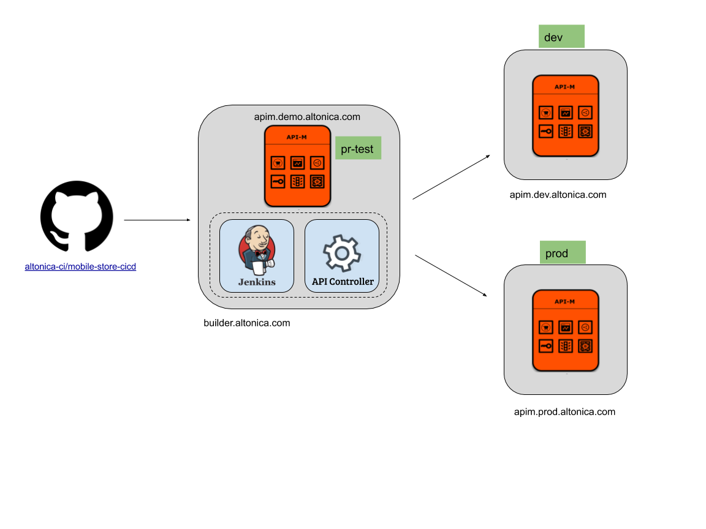

# Automated API Provisioning and Promotion Through CI/CD

## DEMO (CICD)

### Deployment

### Environments of APICTL

Environments of APICTL are defined as below:

| Environment | Host                                | Description                  |
|-------------|-------------------------------------|------------------------------|
| dev         | https://apim.dev.altonica.com:9443  | Dev Environment              |
| prod        | https://apim.prod.altonica.com:9443 | Prod Environment             |
| pr-test     | https://apim.demo.altonica.com:9443 | Testing purposes for Jenkins |

### Steps

#### Configure apictl in Jenkins instance
1. Install apictl in Jenkins instance
2. Configure above 3 environments using apictl
    * eg: Adding dev environment: `apictl add-env --apim https://apim.dev.altonica.com:9443 --token https://apim.dev.altonica.com:8243/token`

#### Configure github

1. Add a webhoo

